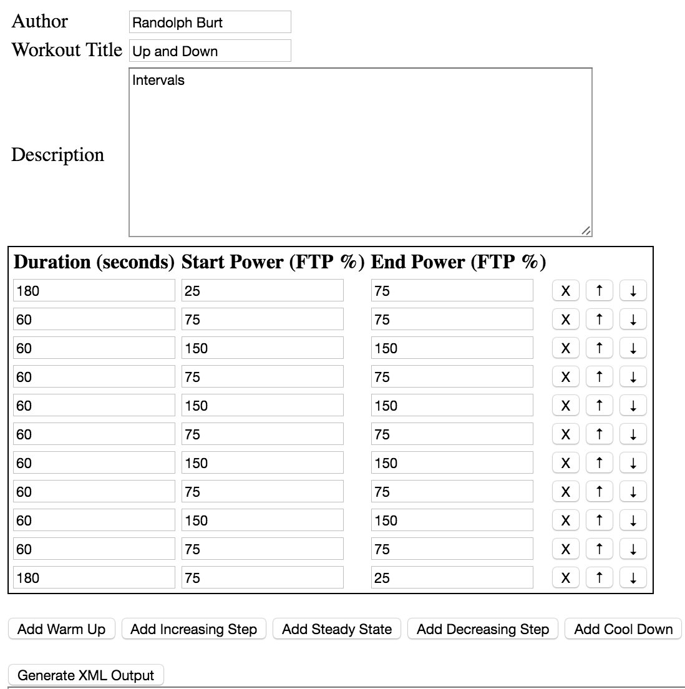
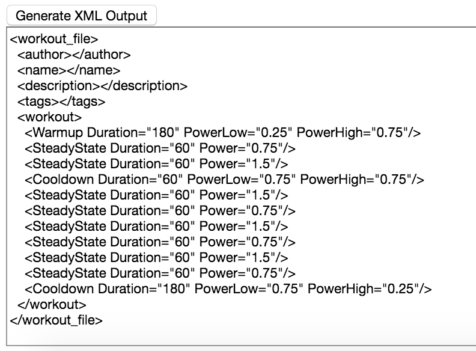
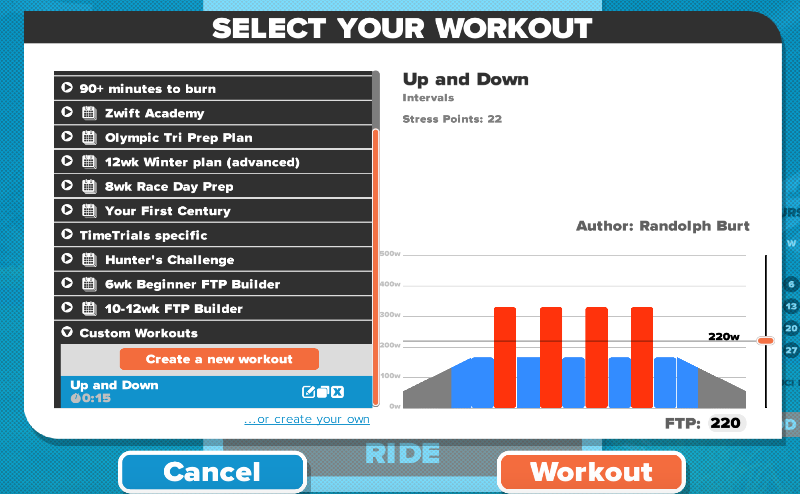
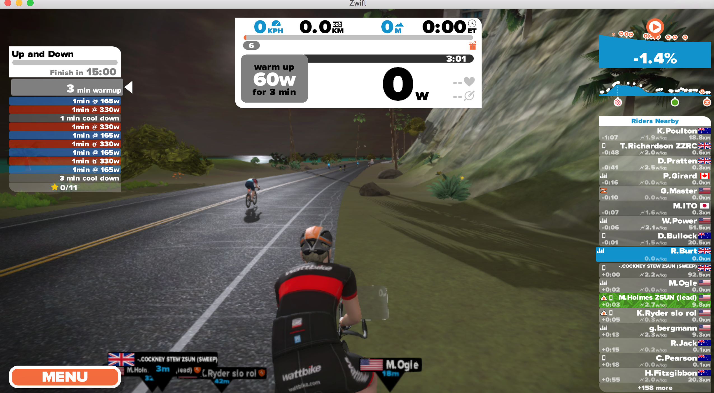

# zwift-workout-creator

If you don't want to use the built in graphical workout creator..

## Summary
 * Generate a Zwift workout xml file by specifying the duration of each step along with the power required, as a percentage of the user's ftp - e.g. a value of 50 means 50% of the users ftp value.  
 * Once you've added all your steps then press the 'Generate Xml Output' button.
 * Then copy and paste the generated xml into a 'zwo' file and save it in you documents/zwift/workouts folder.
 * Restart Zwift and the workout should now be available.
 
## Instructions
 * Enter your name as the author
 * Enter the workout title
 * Enter a description
 * Add each step by pressing one of the 'Add' buttons..
	* **Add Warm up** - Gives you a 25% to 75% increase in power.
	* **Add Increasing Step** - Gives you a ramp up on the previous steps power.
	* **Add Steady State** - Gives you a constant block of power the same as the previous step's end power.
	* **Add decreasing Step** - Gives you a ramp down on the previous steps power.
	* **Add Cool Down** - Gives you a 75% to 25% decrease in power.
 * Move a step up or down by pressing the arrow beside the step, or delete it by pressing the 'x'.
 * Alter the start and end power percentage of each step.

 * Next press the **Generate XML Output** button to create the xml.

 * Copy and paste this into a zwo file in your documents/zwift/workouts folder (or subfolder of that).
 * Restart Zwift and load the workout and off you go!

